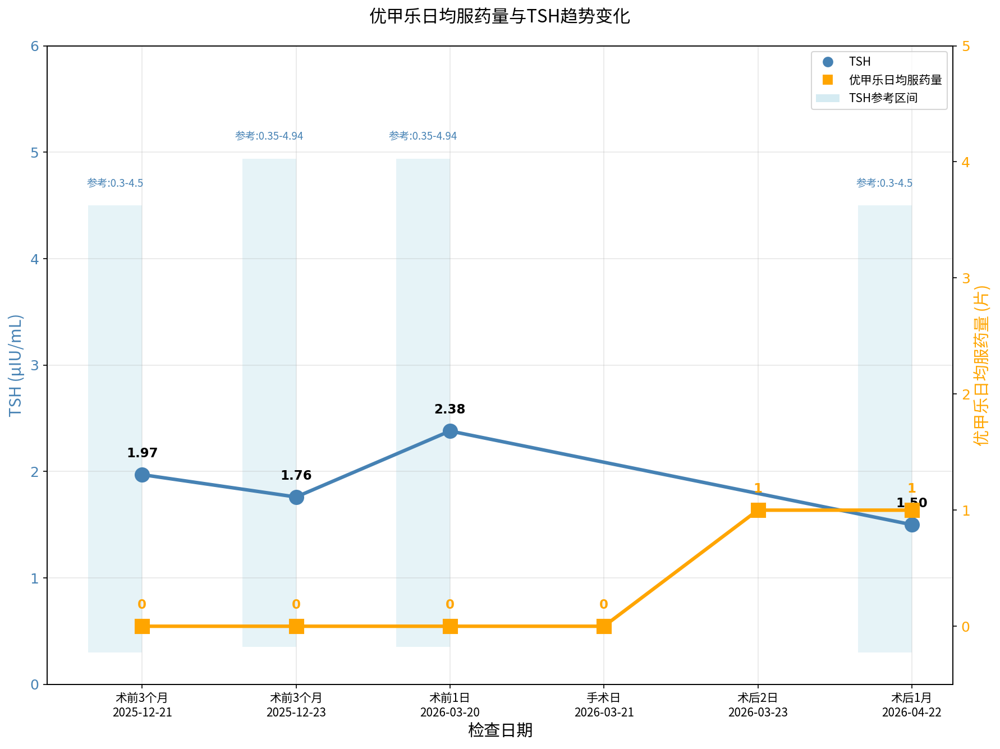
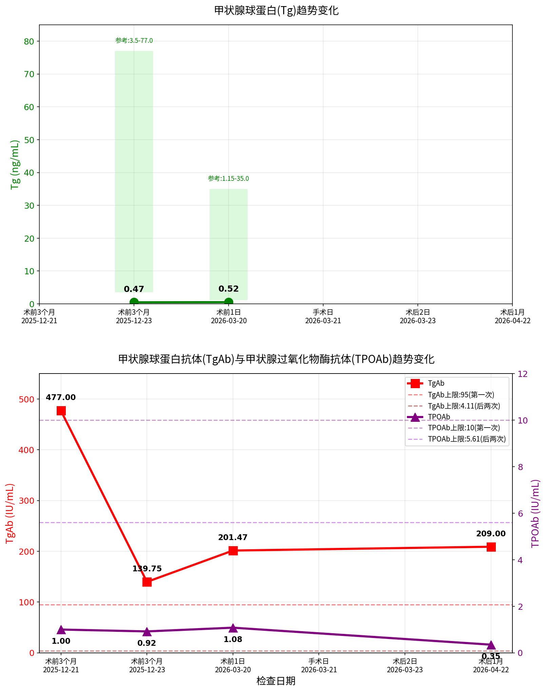
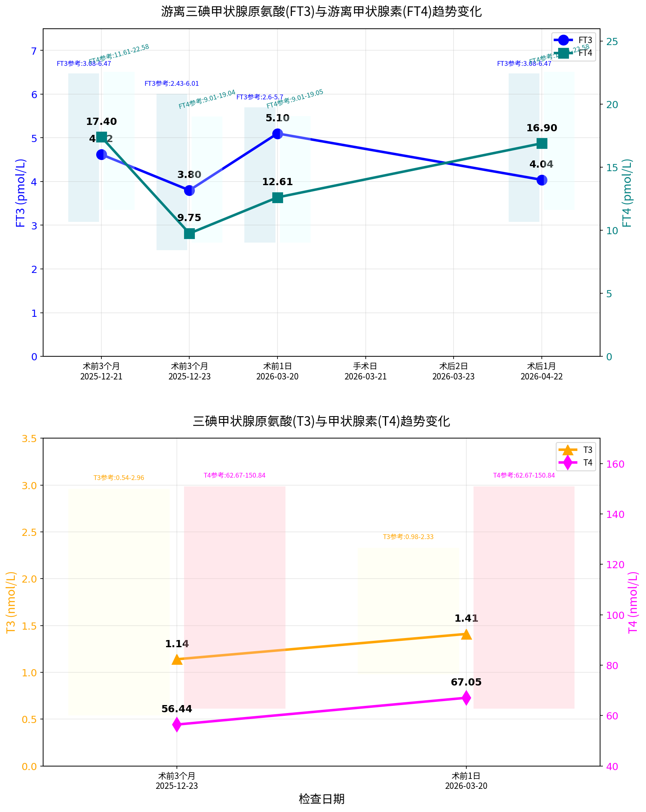

# 甲状腺功能相关检验检查记录报告

---

## 一、检验检查记录表

| 序号 | 检查医院 | 时间节点 | 检查日期 | 优甲乐日均服药量(片) | TSH(μIU/mL) 结果/参考区间 | Tg(ng/mL) 结果/参考区间 | TgAb(IU/mL) 结果/参考区间 | TPOAb(IU/mL) 结果/参考区间 |
|:----:|:--------:|:--------:|:--------:|:--------------------:|:------------------------------:|:----------------------------:|:-------------------------------:|:--------------------------------:|
| 1 | 丰人医 | 术前3个月 | 2025-12-21 | 0 | 1.97 / 0.3-4.5 | — | 477 / 0-95 | 1 / 0-10 |
| 2 | 瑞金医院 | 术前3个月 | 2025-12-23 | 0 | 1.7584 / 0.35-4.94 | 0.473 / 3.5-77 | 139.75 / 0-4.11 | 0.92 / 0-5.61 |
| 3 | 邵逸夫医院 | 术前1日 | 2026-03-20 | 0 | 2.38 / 0.35-4.94 | 0.52 / 1.15-35 | 201.47 / 0-4.11 | 1.08 / 0-5.61 |
| — | 邵逸夫医院 | **手术日** | **2026-03-21** | 0 | — | — | — | — |
| 4 | 邵逸夫医院 | 术后当日 | 2026-03-21 | 0 | — | — | — | — |

### 甲状腺激素水平

| 序号 | FT3(pmol/L) 结果/参考区间 | FT4(pmol/L) 结果/参考区间 | T3(nmol/L) 结果/参考区间 | T4(μg/dL) 结果/参考区间 |
|:----:|:------------------------------:|:------------------------------:|:-----------------------------:|:-----------------------------:|
| 1 | 4.62 / 3.08-6.47 | 17.4 / 11.61-22.58 | — | — |
| 2 | 3.80 / 2.43-6.01 | 9.75 / 9.01-19.04 | 1.14 / 0.54-2.96 | 4.39 / 4.87-11.72 |
| 3 | 5.10 / 2.6-5.7 | 12.61 / 9.01-19.05 | 1.41 / 0.98-2.33 | 5.21 / 4.87-11.72 |
| — | — | — | — | — |
| 4 | — | — | — | — |

### 其他相关指标

| 序号 | PTH(ng/L) 结果/参考区间 | CT(pg/mL) 结果/参考区间 | TRAb(IU/L) 结果/参考区间 | TBG(ng/mL) 结果/参考区间 | TSI(IU/L) 结果/参考区间 | rT3(ng/dL) 结果/参考区间 |
|:----:|:----------------------------:|:----------------------------:|:-----------------------------:|:-----------------------------:|:-----------------------------:|:-----------------------------:|
| 1 | — | — | <0.25 / 0-1.5 | — | — | — |
| 2 | — | 1.41 / 0-10 | 0.8 / 0-1.75 | 7.0 / 14.0-31.0 | <0.1 / 0-0.55 | 44.36 / 20.0-95.0 |
| 3 | 39.7 / 15.0-65.0 | 2.1 / 0-9.2 | — | — | — | — |
| — | — | — | — | — | — | — |
| 4 | — | — | — | — | — | — |

### 维生素D相关

| 序号 | 25-羟基维生素D3 | 25-羟基维生素D2 | 25-羟基维生素D |
|:----:|:-----------------:|:-----------------:|:----------------|
| 4 | 12.30 | 1.33 | 13.63 (参考:<12缺乏;12-20不足;≥20正常) |

---

## 二、趋势变化图

### 图1：优甲乐日均服药量与TSH趋势变化

**图表说明：**
- 上图显示优甲乐左甲状腺素钠片（50μg/片）日均服药量变化
- 下图显示促甲状腺激素(TSH)变化趋势，浅蓝色柱状表示参考区间范围
- 术前TSH值均在正常参考区间内（1.97→1.76→2.38 μIU/mL）

---

### 图2：Tg、TgAb、TPOAb趋势变化

**图表说明：**
- 上坐标系 - Tg（甲状腺球蛋白）：术前呈下降趋势（0.473→0.52 ng/mL），均低于参考下限
- 下坐标系 - TgAb（甲状腺球蛋白抗体）：术前先降后升（477→139.75→201.47 IU/mL），三次均显著高于参考上限
- 下坐标系 - TPOAb（甲状腺过氧化物酶抗体）：始终在正常范围内（1→0.92→1.08 IU/mL）

---

### 图3：FT3、FT4、T3、T4趋势变化

**图表说明：**
- 上坐标系 - FT3（蓝色左轴）+ FT4（青色右轴）：术前先降后升，均在正常范围内
- 下坐标系 - T3（橙色左轴）+ T4（洋红色右轴，单位μg/dL）：
  - T3正常范围（1.14→1.41 nmol/L）
  - T4第一次略低于参考下限（4.39），第二次在正常范围（5.21）

---

## 三、备注说明

### 1. 优甲乐用药说明

- **药物规格**：左甲状腺素钠片 50μg/片
- **术前用药**：术前各次检查日均服药量均为0片
- **术后用药**：术后两日后服用量一般为**1片/日**（50μg），如有变化会另行文字告知
- **用药目的**：甲状腺切除术后替代治疗，抑制TSH以预防肿瘤复发

### 2. 单位换算说明

本次报告对不同医院检验报告中的单位进行了统一换算，换算关系如下：

| 指标 | 原单位 | 目标单位 | 换算系数 | 说明 |
|:----:|:-------:|:---------:|:--------:|:----|
| FT3 | pg/mL | pmol/L | ×1.536 | pg/mL × 1.536 = pmol/L |
| FT4 | ng/dL | pmol/L | ×12.87 | ng/dL × 12.87 = pmol/L |
| T3 | ng/mL | nmol/L | ×1.536 | ng/mL × 1.536 = nmol/L |
| T4 | nmol/L | μg/dL | ÷12.87 | nmol/L ÷ 12.87 = μg/dL |

**换算后保留小数点后两位。**

### 3. 指标名称对应关系

不同医院报告中的指标名称存在差异，已统一标准化：

| 标准名称 | 可能出现的别称 |
|:---------|:----------------|
| TSH | 促甲状腺激素、促甲状腺刺激激素 |
| Tg | 甲状腺球蛋白 |
| TgAb | 甲状腺球蛋白抗体、抗甲状腺球蛋白抗体、TGAb |
| TPOAb | 甲状腺过氧化物酶抗体、抗甲状腺过氧化物酶抗体、ATPO |
| FT3 | 游离三碘甲状腺原氨酸、游离三碘 |
| FT4 | 游离甲状腺素、游离甲状腺 |
| TRAb | 促甲状腺受体抗体、促甲状腺素受体抗体 |
| TSI | 促甲状腺激素受体兴奋性抗体 |

### 4. 参考区间说明

- 不同医院、不同检测方法可能导致参考区间存在差异
- 本表以实际报告中的参考区间为准
- 参考区间随检测批次可能略有调整

### 5. 手术日标记

- **手术日：2026-03-21**
- 该行永久保留，用于计算时间节点
- 手术日及术后当日未进行甲状腺功能相关检验

### 6. 数据解读提示

- **TgAb持续升高**：提示存在自身免疫性甲状腺疾病，需持续监测
- **术前TSH正常**：提示术前甲状腺功能基本正常
- **Tg低于参考下限**：可能与甲状腺自身抗体干扰有关
- **维生素D不足**：术后当日检测25-羟基维生素D为13.63，处于不足范围(12-20)，建议适当补充维生素D

---

**报告生成时间：** 2026年  
**数据来源：** 丰人医、瑞金医院、邵逸夫医院检验报告
